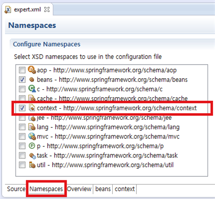

# 스프링 삼각형

POJO(Plain Old Java Object) 기반 Ioc/DI, AOP, PSA 의 스프링 3대 프로그래밍 모델

<br>

## IoC/DI - 제어의 역전/의존성 주입

```java
new Car();  // 운전자가 자동차를 생산
Car 객체생성자 안에서 new Tire();  // 자동차가 내부적으로 타이어를 생산
```

→ 의존성 : new  
→ Car가 Tire에 의존한다 == 전체가 부분에 의존한다!  
<br>

**[스프링 없이 의존성 주입하기 1 - 생성자를 통한 의존성 주입]**

```java
Tire tire = new KoreaTire();  // 운전자가 타이어를 생산
Car car = new Car(tire);  // 운전자가 자동차를 생성하면서 타이어를 장착
```

**주입** ► 자동자 내부에서 타이어를 생산하는 것이 아닌,
외부에서 생산된 타이어를 자동차에 장착!

외부에서 생산된 tire 객체를 Car 생성자의 인자로 주입.

→ new를 통해 타이어를 생성하는 부분이 Car.java에서 Driver.java로 이동,
생산된 tire 객체참조변수를 Car 생성자의 인자로 전달

→ Car 클래스는 더이상 어떤 타이어를 생산해서 장착할지 고민하지 않아도 됨

→ 유연성, 확장성 굳

→ BUT❗️최초로 한번 장착한 이후에 변경이 불가능하다.  
<br>

**[스프링 없이 의존성 주입하기 2 - 속성을 통한 의존성 주입]**

Getter, Setter를 이용!

```java
Tire tire = new KoreaTire();  // 운전자가 타이어를 생산
Car car = new Car();  // 운전자가 자동차를 생산
car.setTire(tire);  // 운전자가 자동차에 타이어를 장착
```

<br>

**[스프링을 통한 의존성 주입 - `@Autowired`를 통한 속성 주입]**
Car 클래스에 tire라는 속성을 만들고, 설정자 메서드를 만드는 코드

```java
import org.springframework.beans.factory.annotation.Autowired;

@Autowired  // 스프링 설정파일을 보고 자동으로 속성의 Setter 역할을 해주겠다는 의미
Tire tire;
```

→ 설정자 메서드 없이도 스프링이 설정 파일을 통해 속성을 주입해줌!!  
 XML 파일에서 bean의 id가 일치하는 것을 찾아서 매칭시킨다.

xml파일 (추가된 코드)

```java
<xml version="1.O" encoding= "UTF-8"?>
<beans xmlns="http:/www.springframework.org/schema/beans"
	xmlns:xsi="http://www.w3.org/2001/XMLSchema-instance" xmlns:context="http://www.springframework.org/schema/context"  // 이거
	xsi:schemaLocation="http://www.springframework.org/schema/beans http://www.springframework.org/schema/beans/spring-beans.xsd
		http://www.springframework.org/schema/context http://www.springframework.org/schema/
context/spring-context-3.1.xsd">  // 이거

	<context:annotation-config />  // 이거

	<bean id="tire" class="expert004.KoreaTire"></bean>
	<bean id="americaTire" class="expert004.AmericaTire"></bean>

	<bean id="car" class="expert004.car"></bean>  // 이거
</beans>
```

xml파일에서 우클릭 > Open With > Spring Config Editor > 하단 Namespaces > Context 체크 → 위 두줄 자동 삽입!  


<br>
🧐 AmericaTire로 변경하려면 어디를 고쳐야 할까?  
→ xml 파일에서 bean의 id만 변경하면 된다

```java
<bean id="tire02" class="expert004.KoreaTire"></bean>
<bean id="tire" class="expert004.AmericaTire"></bean>
```

<br>

✏️ `@Autowired`를 통한 속성 매칭 규칙 (feat.인터페이스의 구현)  


<br>

## AOP

**: Aspect-Oriented Programming**

- 스프링 AOP는 인터페이스(interface) 기반이다.
- 스프링 AOP는 프록시(proxy) 기반이다.
- 스프링 AOP는 런차임(runtime) 기반이다.

<br>
DI가 의존성(new)에 대한 주입이라면,  
AOP는 로직(code)의 주입!

<br>

**코드 = 핵심 관심사 + 횡단 관심사**

- 핵심 관심사: 모듈별로 다른 부분
- 횡단 관심사: 모듈별로 반복되어 나타나는 부분

<br>

**메서드에서 로직(코드)을 주입할 수 있는 곳:**  
Around (메서드 전 구역)  
Before (메서드 시작 전)  
After (메서드 종료 후)  
AfterReturning (메서드 정상 종료 후)  
AfterThrowing (메서드에서 예외 발생하면서 종료 후)

<br>

**AOP 적용 전후 Boy.java 및 관련 코드 비교**  


→ `@Aspect` : 이 클래스를 AOP에서 사용하겠다는 의미

→ JoinPoint : `@Before`에서 선언된 메서드인 `aop002.Boy.runSomething()`  
→ bean 설정 : 객체의 생성과 의존성 주입을 스프링 프레임워크에 위임  
<br>

pom.xml에 없으면 추가

```java
<dependency>
	<groupId>org.aspectj</groupId>
	<artifactId>aspectjweaver</artifactId>
	<version>1.6.11</version>
</dependency>
```

👉 Boy.java에 SRP를 자연스럽게 적용하게 됨!  
<br>

**AOP를 통해 런타임에 로직 주입**  

<br>

**AOP 전후의 Boy.java, Girl.java 의 변화와 관련 코드**

<br>
→ 빨간색 : 스프링 AOP가 인터페이스 기반으로 작동하는 요건 충족을 위한것  
→ `<aop:aspectj-autoproxy />` 는 뭔가요  
스프링 프레임워크에 AOP 프록시를 사용하라고 지시하는 것!  
프록시를 이용해 호출하면 프록시가 메서드 호출 요청을 진짜 객체에게 전달해줌


✏️ 중간의 `runSomething()` 메서드는 주고받는 내용을 감지하거나 조작할 수 있음  
<br>

**Pointcut - Aspect 적용 위치 지정자**

횡단 관심사를 적용할 타깃 메서드를 선택하는 지시자  
`@Before("execution(*runsomething())")`에서 `*runsomething()`
→ 이 메서드를 Pointcut이 실행되기 전에 실행하겠다  
<br>

**JoinPoint - Aspect 적용이 가능한 모든 지점**

- Pointcut의 후보가 되는 모든 메서드들
  스프링 프레임워크가 관리하는 Bean의 모든 메서드

- 호출된 객체의 메서드

<br>
실행 시점에 실제 호출된 메서드, 그걸 소유한 객체, 파라마터 등의 정보 확인 가능  
<br>

**Advice - Pointcut에 언제, 무엇을 적용할지 정의한 메서드**

MyAspect.java 의 내부..!  
(지정된 Pointcut이 시작되기 전(@Before)에 before() 메서드를 실행하라)  
<br>

**Aspect - Advisor의 집합체**

Aspect = Advice들 + Pointcut들  
<br>

**Advisor - 언제 어디서 무엇을**

Advisor = 한 개의 Advice + 한 개의 Pointcut  
<br>

## PSA - 일관성 있는 서비스 추상화

**: Portable Service Abstraction**  
<br>

서비스 추상화 : JDBC처럼, 어댑터 패턴을 적용해 같은 일을 하는 다수의 기술을 공통의 인터페이스로 제어할 수 있게 한 것  
<br>

**[스프링이 제공하는 다양한 어댑터]**  
OXM, ORM, 캐시, 트랜잭션, …  
<br>
