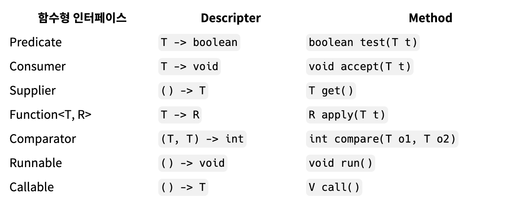

자바8 에서 병렬화를 위한 컬렉션(배열, List, Set, Map)을 강화  
→ 이 컬렉션들을 더 효율적으로 사용하기 위해 Stream을 강화  
<br>
Stream을 효율적으로 사용하기 위해 함수형 프로그래밍의 변화..  
→ 함수형 프로그래밍의 위해 람다 도입  
→ 람다를 위해 인터페이스 명세 변경  
→ 함수형 인터페이스 도입
<br>

## 람다와 스트림

**람다**: 코드 블록 → 메서드의 인자나 반환값으로 사용 가능! 변수처뤔.
<br>
기존 방식, 별도의 클래스와 메서드 생성

```java
public class Example1 {
	public static void main(String[] args) {
		MyTest mt = new MyTest();

		Runnable r = mt;

		r.run();
	}
}

class MyTest implements Runnable {
	public void run() {
		System.out.pringln("Hello Lambda!");
	}
}
```

<br>
기존 방식, 익명 객체 생성 방식

```java
public class Example2 {
	public static void main(String[] args) {
		Runnable r = new Runnable() {
			public void run() {
				System.out.println("Hello Lambda!");
			}
		};

		r.run();
	}
}
```

<br>
새로운 방식, 람다

```java
public class Example3 {
	public static void main(String[] args) {
		Runnable r = () -> {
			System.out.println("Hello Lambda!");
		};

		r.run();
	}
}
```

익명 객체도 필요가 없다~

- Runnable 타입으로 참조변수 r을 만듦. 컴파일러가 알 수 있음!
- `public void run()` 메서드가 `()`로 바뀔 수 있음! Runnable 인터페이스가 가진 추상 메서드가 `run()` 하나이기 때문.
- `(인자 목록) -> {로직}` 의 구조

<br>

**함수형 인터페이스** : 추상 메서드를 하나만 갖는 인터페이스 → 람다식으로 변경 가능!

```java
public class Example4 {
	public static void main(String[] args) {
		MyFunctionalInterface mfi = (int a) -> { return a * a; };

		int b = mfi.runSomething(5);

		System.out.println(b);
	}
}

@FunctionalInterface
interface MyFunctionalInterface {
	public abstract int runSomething(int count);
}
```

<br>

`@FunctionalInterface` 어노테이션이 붙은 인터페이스 : 하나의 추상 메서드만 가지고 있는지 컴파일러가 검사  
<br>
`runSomething`의 정의에서 a가 int일수밖에 없음을 알 수 있음  
최적화된 코드:

```java
public class Example5 {
	public static void main(String[] args) {
		MyFunctionalInterface mfi = a -> a * a;

		int b = mfi.runSomething(5);

		System.out.println(b);
	}
}

@FunctionalInterface
interface MyFunctionalInterface {
	public abstract int runSomething(int count);
}
```

<br>

**메서드 호출 인자로 람다 사용**

```java
public class Example6 {
	public static void main(String[] args) {
		MyFunctionalInterface mfi = a -> a * a;

		doIt(mfi);
	}

	public static void doIt(**MyFunctionalInterface mfi**) {
		int b = mfi.runSomething(5);

		System.out.println(b);
	}
}
```

최적화된 코드:

```java
public class Example6 {
	public static void main(String[] args) {
		doIt(a -> a * a);
	}

	public static void doIt(MyFunctionalInterface mfi) {
		int b = mfi.runSomething(5);

		System.out.println(b);
	}
}
```

<br>

**메서드 반환값으로 람다 사용**

```java
public class Example6 {
	public static void main(String[] args) {
		MyFunctionalInterface mfi = todo();

		int result = mfi.runSomething(3);

		System.out.println(result);
	}

	public static MyFunctionalInterface todo() {
		return num -> num * num;
	}
}
```

<br>

**자바8 API에서 제공하는 대표적인 함수형 인터페이스**

  
<br>

**컬렉션 스트림에서 람다 사용**

```java
public class Example7 {
	public static void main(String[] args) {
		Integer[] ages = { 20, 25, 18, 27, 30, 21, 17, 19, 34, 28 };

		for (int age : ages) {
			if (age < 20) {
				System.out.format("Age %d!!! Can't enter/n", age);
			}
		}
	}
}
```

스트림 사용 코드:

```java
import java.util.Arrays;

public class B013 {
	public static void main(String[] args) {
		Integer[] ages = { 20, 25, 18, 27, 30, 21, 17, 19, 34, 28 };

		Arrays.stream(ages)
			.filter(age -> age < 20)
			.forEach(age -> System.out.format("Age %d!!! Can't enter/n", age));
	}
}
```

`.filter()` : SQL문의 WHERE절과 같은 역할  
고객의 요구를 선언적으로 코딩할 수 있다.  
<br>

**메서드 레퍼런스와 람다식 비교**

<br>

## Optional

Java8에서는 Optional<T> 클래스를 사용해 NPE를 방지할 수 있음.  
Optional<T> 는 null이 올 수 있는 값을 감싸는 Wrapper 클래스.  
참조하더라도 NPE가 발생하지 않도록 도와준다.  
<br>
Optional 클래스는 아래와 같은 value에 값을 저장하기 때문에 값이 null이더라도 바로 NPE가 발생하지 않음.  
<br>
Java8에서는 Optional<T> 클래스를 사용해 NPE를 방지할 수 있음.  
Optional<T> 는 null이 올 수 있는 값을 감싸는 Wrapper 클래스.  
참조하더라도 NPE가 발생하지 않도록 도와준다.  
<br>
Optional 클래스는 아래와 같은 value에 값을 저장하기 때문에 값이 null이더라도 바로 NPE가 발생하지 않음.  
<br>

**😺 `Optional.empty()` - 값이 null인 경우**

Optional은 Wrapper 클래스이기 때문에 값이 없을 수도 있음.

```java
Optional<String> optional = Optional.empty();

System.out.println(optional); // Optional.empty
System.out.println(optional.isPresent()); // false
```

<br>
💡 Optional 클래스는 내부에서 static 변수로 EMPTY 객체를 미리 생성해서 가지고 있음.
<br>

**😺 `Optional.of()` - 값이 절대 null이 아닌 경우**

```java
Optional<String> optional = Optional.of("MyName");
```

<br>

**😺 `Optional.ofNullable()` - 값이 null일수도, 아닐수도 있는 경우**

값이 없는 경우라도 orElse 또는 orElseGet 메소드로 값 가져올 수 있음.

```java
Optional<String> optional = Optional.ofNullable(getName());
String name = optional.orElse("anonymous"); // 값이 없다면 "anonymous" 를 리턴
```
